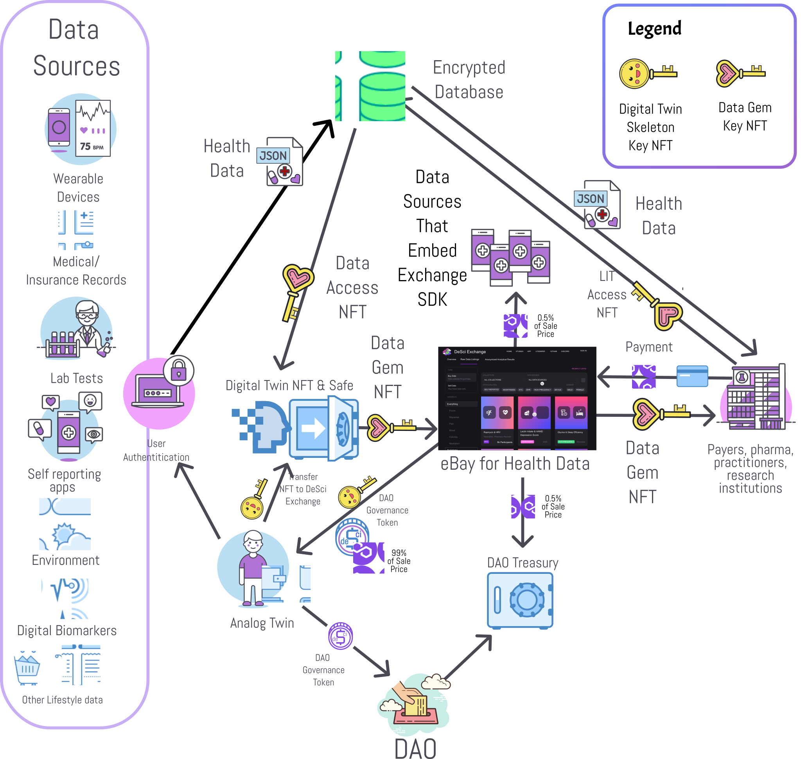

# The DeSci Exchange

***A Free Market for Accelerating Scientific Discovery***

## How it works

## Architecture Overview

# Digital Twin Skeleton Key NFT

Possession is checked when accessing your Digital Twin Safe.
If you don't have the key, you're prompted to mint one.

The Digital Twin Skeleton Key NFT is a soul-bound NFT that can only be minted if you do not already have one.

This key gives you the ability to mint [Data Gem Data Access NFTs](../data-gem/README.md) using your imported data.

### Life Force Score

The attached avatar image and Life Force Score metadata are updated daily based on their imported data performing
healthy activities, such as having a good sleep schedule, hydrating, and exercising.

This metadata is available to various metaverse game ecosystems and can influence their scores and abilities in these
games.

[CONTRACTS AND MORE INFO ABOUT DIGITAL TWIN NFTS](packages/desci-exchange/contracts/digital-twin/README.md)

# Data Gems

Data Gems bestow their holder with magical powers enabling them to transcend the physical world and see an aspect of its inter-dimensionally linked digital twin.

A more boring way to put it, is to say that Data Gems are NFT tokens that give the holder the ability to decrypt a data stream.

They can be mined by the data owner and can be given or sold to other Analog Twins or businesses.

[CONTRACTS AND MORE INFO ABOUT DATA GEMS](packages/desci-exchange/contracts/data-gem/README.md)

## Benefits

### For Individuals

- eBay for health data - You can earn magic internet money by selling your data regarding symptoms, treatments, and
  factors to pharmaceutical companies, insurance companies, and other data buyers
- Control access and use of your data through fine-grained permissions
- Continuously monitor and audit the data you provide to other organizations

### For Health Apps

- Connected real-world data yields better insights for your users
- Apps that embed the exchange in their app earn a 0.5% transaction fee for each data sale
- Connect to third-party sources to enrich your data, or easily connect to a user's existing data

### For Pharmaceutical Companies

- Conduct long-term safety and effectiveness studies by linking their clinical trial data to medical claims and
  electronic health record data
- Refine models for finding rare disease patients by linking diagnostic lab, genomic, and imaging data
- Discover new therapeutic candidates with connected data

### For Insurers

- Improve value-based care analytics and sharpen total cost of care estimates by linking to EHR and clinical data
- Connect to the nation's largest ecosystem of health data
- Hone risk adjustment factor calculations by linking claims to social determinant's data, to properly estimate the true
  cost of patient care

## Governance

The DeSci Exchange is democratically governed by the Citizen Scientists who contribute data.

Upon participation in the DeSci Exchange, the Citizen Scientist is rewarded with DeSci Tokens ($DSCI) which can be
used to vote on the governance of
the [Aragon DeSci DAO](https://client.aragon.org/#/desci/0x24accccb8d4329aecfcb4347b3e92c8fd1349c01/).

60,000,000,000 $DSCI tokens were minted at genesis. This is number is fixed and cannot be changed. It is the same
number as the number of dollars used to purchase anonymized health records from EHR companies each year.

## Web2 Technologies Used

### Nx devtools

[Nx](https://nx.dev/) is a set of extensible dev tools for monorepos.

### React

A JavaScript library for building user interfaces.

### Nxext

[Nxext](https://nxext.dev/) brings different tools Nx

### StencilJs

[Stencil](https://stenciljs.com/) is for building reusable, scalable Design Systems with standards based Web Components.

- https://github.com/spruceid/siwe-notepad

🔎 **Smart, Fast and Extensible Build System**

#### Adding capabilities to your workspace

Nx supports many plugins which add capabilities for developing different types of applications and different tools.

These capabilities include generating applications, libraries, etc as well as the devtools to test, and build projects
as well.

Below are our core plugins:

- [React](https://reactjs.org)
    - `npm install --save-dev @nrwl/react`
- Web (no framework frontends)
    - `npm install --save-dev @nrwl/web`
- [Angular](https://angular.io)
    - `npm install --save-dev @nrwl/angular`
- [Nest](https://nestjs.com)
    - `npm install --save-dev @nrwl/nest`
- [Express](https://expressjs.com)
    - `npm install --save-dev @nrwl/express`
- [Node](https://nodejs.org)
    - `npm install --save-dev @nrwl/node`

There are also many [community plugins](https://nx.dev/community) you could add.

## Generate an application

Run `nx g @nrwl/react:app desci-exchange` to generate an application.

> You can use any of the plugins above to generate applications as well.

When using Nx, you can create multiple applications and libraries in the same workspace.

## Generate a library

Run `nx g @nrwl/react:lib my-lib` to generate a library.

> You can also use any of the plugins above to generate libraries as well.

Libraries are shareable across libraries and applications. They can be imported from `@desci/mylib`.

## Development server

Run `nx serve desci-exchange` for a dev server. Navigate to http://localhost:4200/. The app will automatically reload if
you change any of the source files.

## Code scaffolding

Run `nx g @nrwl/react:component my-component --project=desci-exchange` to generate a new component.

## Build

Run `nx build desci-exchange` to build the project. The build artifacts will be stored in the `dist/` directory. Use
the `--prod` flag for a production build.

## Running unit tests

Run `nx test desci-exchange` to execute the unit tests via [Jest](https://jestjs.io).

Run `nx affected:test` to execute the unit tests affected by a change.

## Running end-to-end tests

Run `nx e2e desci-exchange` to execute the end-to-end tests via [Cypress](https://www.cypress.io).

Run `nx affected:e2e` to execute the end-to-end tests affected by a change.

## Understand your workspace

Run `nx graph` to see a diagram of the dependencies of your projects.

## ☁ Nx Cloud

### Distributed Computation Caching & Distributed Task Execution

[Nx Cloud](https://nx.app/) pairs with Nx in order to enable you to build and test code more rapidly.
