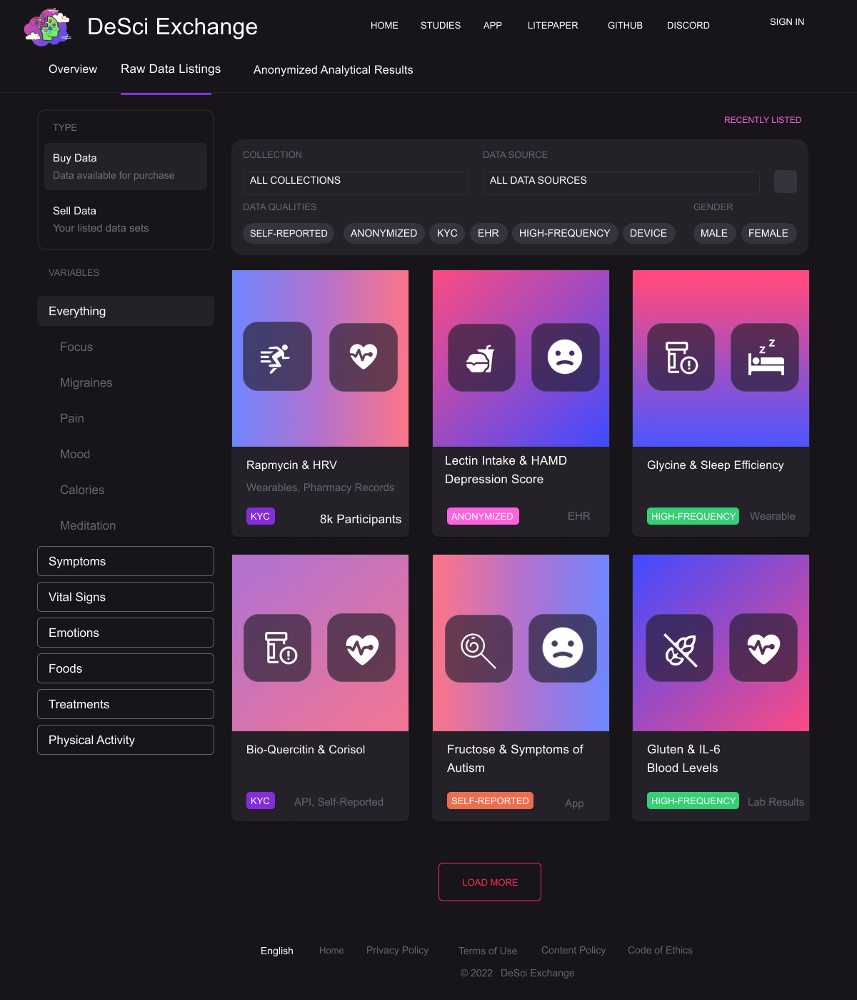

# The DeSci Exchange

***A Free Market for Accelerating Scientific Discovery***


## Benefits

### For Individuals

- eBay for health data - You can earn magic internet money by selling your data regarding symptoms, treatments, and 
  factors to pharmaceutical companies, insurance companies, and other data buyers
- Control access and use of your data through fine-grained permissions
- Continuously monitor and audit the data you provide to other organizations

### For Health Apps

- Connected real-world data yields better insights for your users
- Apps that embed the exchange in their app earn a 0.5% transaction fee for each data sale
- Connect to third-party sources to enrich your data, or easily connect to a user's existing data

### For Pharmaceutical Companies

- Conduct long-term safety and effectiveness studies by linking their clinical trial data to medical claims and electronic health record data
- Refine models for finding rare disease patients by linking diagnostic lab, genomic, and imaging data
- Discover new therapeutic candidates with connected data

### For Insurers

- Improve value-based care analytics and sharpen total cost of care estimates by linking to EHR and clinical data
- Connect to the nation's largest ecosystem of health data
- Hone risk adjustment factor calculations by linking claims to social determinant's data, to properly estimate the true cost of patient care

## How It Works

1. Connect your Metamask wallet at [desci.exchange](https://desci.exchange)
2. Click on one of the 3rd party data sources like Fitbit or Oura to connect your account
3. Your data is imported into your personal data wallet.
4. Click on a variable whose measurements you'd like to sell, set a price, and submit.
5. Your data will then be listed in the data marketplace
6. A data buyer such as a pharmaceutical or insurance company purchases your data set
7. You get 99% of the tokens, the app receives 0.5%, and DeSci Exchange DAO token holders receive 0.5%

## Types of NFTs

1. **Digital Twin NFTs (DT-NFT)** - An DT-NFT is a digital representation you in the form of an ERC 1155 token. A DT-NFT is minted once the first time the user logs into DeSci.Exchange. 
2. **Data Access NFTs** - These are ERC 1155 NFTs that represent a data set such as some time series data of symptom severity recordings or when you took a specific medication. They are created when you click to sell a data set and are sent to your wallet or Digital Twin Safe. These NFT's can be sold on the DeSci.Exchange.  The possession of these NFTs grant access to the associated data set.

## Detailed Technical Flow

1. The user clicks to connect your Metamask wallet at [desci.exchange](https://desci.exchange) links to the user's
   Ceramic DID with the [Self.ID SDK](https://developers.ceramic.network/reference/self-id/)
2. The user clicks the "Import" button on one of the 3rd party data sources like Fitbit or Oura to connect their account.
3. The user is redirected to the 3rd party data source to authenticate and authorize the app to access their data.
4. The user is redirected back to the backend server, with an authorization code.
5. The backend server exchanges the authorization code for an access token
6. The backend server uses the access token to fetch the user's measurements from the 3rd party data source API.
7. The backend server stores the user's data, access, and refresh token in their Personal Data Wallet, an encrypted
   [DID DataStore](https://developers.ceramic.network/tools/glaze/did-datastore/) stored on Ceramic and accessible via DID link to their wallet).
8. The app fetches a [list of variables](https://api.curedao.org/api/v3/variables?accessToken=demo) from the back end
   server and lists then on the "Your Data" page.

```javascript
const variables = await fetch(
  "https://api.curedao.org/api/v3/variables?accessToken=demo"
).then((res) => res.json());
```

9. The user sees a [list of variables](https://api.curedao.org/api/v3/variables?accessToken=demo) whose measurements they can to sell.
   
10. They can click a "Sell Data" button set a price, and click submit.
11. A GET request is made to the `variable.url` to fetch an HTML mega-study for that variable including data
    visualizations and relationships with other variables.

```javascript
const html = await fetch(variable.url, {
  method: 'GET',
  headers: {
    'Content-Type': 'application/json',
    'Authorization': `Bearer ${accessToken}`
  }
})
const { tokenId, tokenAddress, mintingAddress, txHash, errorCode, authSig } = await LitJsSdk.mintLIT({ chain, quantity })
const { symmetricKey, encryptedZip } = await LitJsSdk.zipAndEncryptString(lockedFileMediaGridHtml)
const accessControlConditions = [
  {
    contractAddress: '0x3110c39b428221012934A7F617913b095BC1078C',
    standardContractType: 'ERC1155',
    chain,
    method: 'balanceOf',
    parameters: [
      ':userAddress',
      '9541'
    ],
    returnValueTest: {
      comparator: '>',
      value: '0'
    }
  }
]

const encryptedSymmetricKey = await window.litNodeClient.saveEncryptionKey({
  accessControlConditions,
  symmetricKey,
  authSig,
  chain
})
```

12. The obtained HTML is stored in a Digital Twin NFT (DT-NFT), an [ERC 1155 Locked HTML NFT](https://developer.litprotocol.com/ToolsAndExamples/SDKExamples/HTMLNfts).
13. The DT-NFT is stored on IPFS vs Pinata or nft.storage.

```javascript
const litHtmlBlob = new Blob(
  [htmlString],
  { type: 'text/html' }
)
const formData = new FormData()
formData.append('file', litHtmlBlob)

const uploadRespBody = await new Promise((resolve, reject) => {
  fetch('https://api.pinata.cloud/pinning/pinFileToIPFS', {
    method: 'POST',
    mode: 'cors',
    headers: {
      Authorization: `Bearer ${PINATA_API_KEY}`
    },
    body: formData
  }).then(response => response.json())
    .then(data => resolve(data))
    .catch(err => reject(err))
})
const ipfsCid = uploadRespBody.IpfsHash
const fileUrl = `https://ipfs.io/ipfs/${ipfsCid}`
```

14. The NFT contract, price, image, and sale status is stored using TableLand.
15. All NFTs for all users are fetched from Tableland and listed on the "Data Marketplace" page
    
16. A data buyer such as a pharmaceutical or insurance company purchases a data set
17. You get 99% of the tokens, the app receives 0.5%, and DeSci Exchange DAO token holders receive 0.5%

## Technologies Used

- [**Filecoin**](https://filecoin.io/) allows users to store, request, and transfer their data via a verifiable marketplace.
- NFT.storage and web3.storage to use IPFS for data content addressing and Filecoin for persistent, decentralized
  storage of Personal Data NFTs (DT-NFTs).
- Polygon is used for the [DeSci.Exchange Aragon DAO](https://client.aragon.org/#/desci/) governance and utility token `$DESCI`
- **Superfluid** asset streaming protocol that enables data subscriptions, payments, and transaction fees for DeSci DAO and health apps. It's used to define data revenue sharing execute transactions automatically on-chain over time in a non-interactive way.
- **[Worldcoin](https://worldcoin.notion.site/Worldcoin-ETHOnline-71c88760a85a49eb9fc383c8cdc241eb)** is a Privacy-Preserving Proof-of-Personhood Protocol (PPPoPP). World ID enables data sharing to be anonymous while protected against sybil attacks providing false bot-generated data.
- Ceramic - Composable data layer
- Lit Protocol - Decentralized token, NFT, and DID-based access control for private data and applications

## Types of NFTs

### 1. Digital Twin NFTs

Digital Twin NFTs (DT-NFTs) are ERC 1155 soul-bound token NFTs data set and a set of permissions. DT-NFTs are created when a user first logs into the app.

DT-NFTs are comprised of the following components:

- **Transactional ID**: Tracks all user data related to transaction history. Its basic unit is the wallet address. Finally, the main incentive for protocols to request this data is: Risk Mitigation and network benefits.
- **Personal ID**: Tracks a users biometric/legal verification data. Its basic unit is an individual.
  The main incentive to store and use this type of data is sybil attack resistance, legal compliance and sensitive data exchange.
- **Collateralized ID**: Tracks user data related to asset ownership and staking history.
  The main unit of measurement is the asset. The main incentive for using this type of ID is to have users provide skin-in-the-game to prove membership/proper participation in a particular community.
- **Social ID**: As mostly seen on Web 2.0 social networks, this type of ID tracks user activity related to social behaviors: level of interaction with certain types of content, likes, retweets, etc.Its basic unit is the persona (a user can have multiple personas for different apps). The main incentive to store this type of data is to prove a user has particular interests and is engaged with a particular community.
- **Reputational ID**: Tracks user data related to a users track record. The on-chain equivalent of a CV or resume. Its
  measurement unit is the number of accolades/accomplishments/experiences a user has.
  The incentive for collecting this type of data is to prove a user’s track record, ensuring high contributor quality, experiential history verification and automated background checks.
- **Data IDs**: This type of data focuses on on-chain and off-chain storage mapping. It is a layer beneath to what a user
  would directly interact/influence.
  It provides the raw on/off chain data for user identity to be classified under the buckets presented above.

## References

1. [ethglobal.com/events/ethonline2022](https://ethglobal.com/events/ethonline2022)
2. [https://docs.unlock-protocol.com/tutorials/building-token-gated-applications](https://docs.unlock-protocol.com/tutorials/building-token-gated-applications)
3. [Token-gating Express.js](https://docs.unlock-protocol.com/tutorials/backend-locking-with-express.js)
